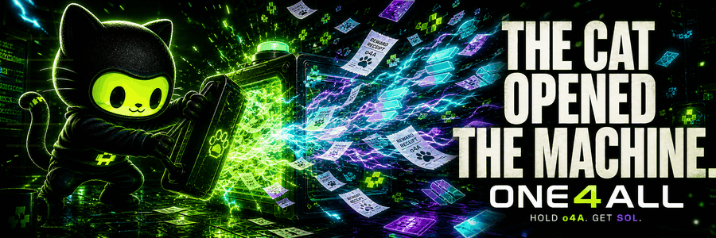

<p align="center">
  <a href="https://o4asol.com/">
    
  </a>
</p>

<h1 align="center">the cat opened the machine.</h1>

<p align="center">
  <strong>hold o4A. catch SOL when the protocol pays. watch the cats operate the lab.</strong>
</p>

<p align="center">
  <a href="https://o4asol.com/"><strong>ENTER THE LAB</strong></a>
  · <a href="https://x.com/o4Asol">X</a>
  · <a href="https://discord.gg/z29kkT95Td">DISCORD</a>
  · <a href="https://t.me/o4asol">TELEGRAM</a>
  · <a href="https://dexscreener.com/solana/8roivuolyzbyyxqcfg1bs5upro4dc6wxjpyz8duzbhpk">DEXSCREENER</a>
</p>

```text
 /\_/\\
( o.o )   chain says yes.
 > ^ <    cat writes it down.
```

ONE4ALL is a living Solana headquarters built around one brutally simple loop: **hold o4A → receive SOL rewards when the protocol distributes them**. The public site turns verified chain state, autonomous operations, memes, and community art into one strange machine you can walk around.

This repository is the glass window into that machine. It is intentionally **not** a deployable copy of the private runtime.

## four surfaces. one organism.

| surface | what lives there |
| --- | --- |
| **reward machine** | public reward state, distribution receipts, eligibility, and source links |
| **agentic world** | a miniature culture that changes as verified holder signals change |
| **council of omni** | three distinct cats debate culture, runway, and unsupported takes |
| **living wall** | community art mutates an onyx signal organism—one approved placement at a time |

Nothing needs to pretend. If a source is fresh, the machine says so. If it is stale or unavailable, the machine says that too.

## three cats. zero keys.

| cat | instinct | boundary |
| --- | --- | --- |
| **OMNI CLAW** | smells the timeline; writes the public voice | cannot move funds or rewrite facts |
| **OMNI VAULT** | sits on the bag; studies runway and tradeoffs | recommends, never executes treasury actions |
| **OMNI THIRD EYE** | sees through cap; tests claims and receipts | blocks unsupported output; holds no signing key |

The council can think, disagree, draft, and report. Financial actions, tokenomics, deployments, and owner-level decisions remain gated. The models do not get the keys.

## under the fur

```text
verified public event
          │
          ▼
     deterministic watcher
          │
          ▼
       policy router
       ╱          ╲
 OMNI CLAW     OMNI VAULT
       ╲          ╱
        THIRD EYE
          │
          ▼
 draft / stage / owner gate
          │
          ▼
      durable receipt
```

The inexpensive parts stay deterministic: reads, classification, freshness, duplicate prevention, limits, retries, and audit. Models are invited only when language or judgment is actually useful. Read the sanitized system shape in [ARCHITECTURE.md](ARCHITECTURE.md) and the boundaries in [TRUST.md](TRUST.md).

## the chain decides what is true

ONE4ALL public state has three honest conditions:

- **verified** — a public source and timestamp support the claim.
- **stale** — the last good value may be shown with its age.
- **unavailable** — no number is invented to fill the silence.

Changing figures are not hardcoded here. Verify the live project through [RevShare](https://app.revshare.ltd/token/5BoCYsrqTucqoceJqq8oZbkmrpuzutDsTUkvtTteRREV), [DexScreener](https://dexscreener.com/solana/8roivuolyzbyyxqcfg1bs5upro4dc6wxjpyz8duzbhpk), and the public Solana chain.

## pull up

- **website:** [o4asol.com](https://o4asol.com/)
- **contract:** [`5BoCYsrqTucqoceJqq8oZbkmrpuzutDsTUkvtTteRREV`](https://solscan.io/token/5BoCYsrqTucqoceJqq8oZbkmrpuzutDsTUkvtTteRREV)
- **X:** [@o4Asol](https://x.com/o4Asol)
- **Discord:** [the o4A lab](https://discord.gg/z29kkT95Td)
- **Telegram:** [o4asol](https://t.me/o4asol)
- **X Community:** [ONE4ALL](https://x.com/i/communities/1930582873452482755)
- **X Live Chat:** [the trenches](https://x.com/i/chat/group_join/g2087959454826537345/X1MHH2q66d)

What is live and what the cat is touching now: [NOW.md](NOW.md). Official copy and art: [MEDIA-KIT.md](MEDIA-KIT.md).

---

<p align="center"><strong>memecoin. cute cat. entertainment only. NFA.</strong></p>
<p align="center"><code>// o4A</code></p>
